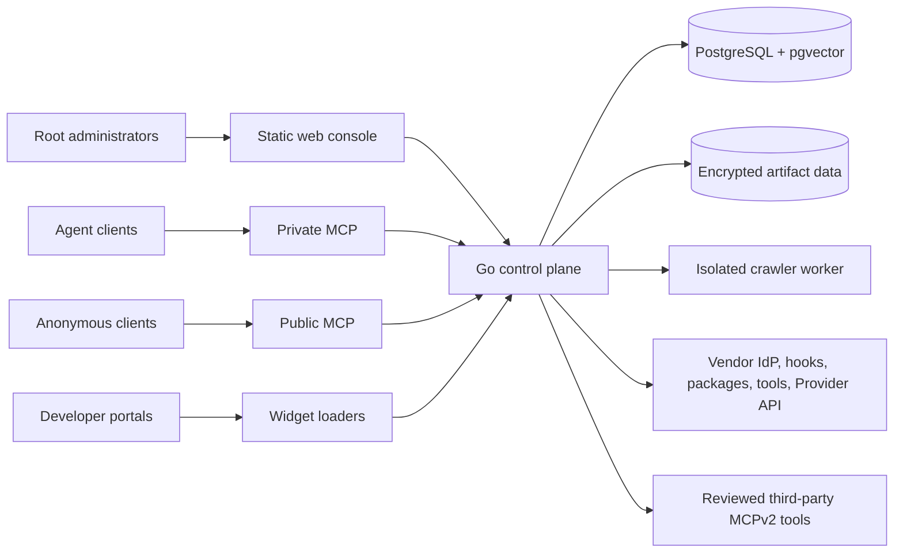
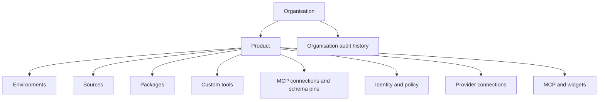

DokoSoko is one control plane with deliberately separate access surfaces.

## Runtime components

### Go control plane

The service owns administrative APIs, OAuth, MCP, package streaming, publication policy, audit, analytics, and runtime authorization. It also serves the statically built web console.

### Static console

Root administrators configure organisations, products, sources, packages, tools, identity, providers, environments, and operations. Persistent integration secrets are encrypted before storage and are not returned to the browser.

### PostgreSQL and artifact data

PostgreSQL stores product configuration, publication state, identity records, token digests, audit events, analytics, and vector-backed knowledge metadata. Artifact data is stored separately; both stores must be backed up together.

### Crawler worker

The crawler is an isolated Node.js process. It discovers from sitemaps first, uses Cheerio for the fast path, falls back to Playwright when necessary, and writes immutable snapshots for review. Crawl budgets, SSRF defenses, and prompt-injection scanning constrain untrusted input.

### Vendor systems

DokoSoko connects to fixed HTTPS destinations: a vendor OIDC provider, entitlement and authorization hooks, package origins, custom tool hooks, a standard Provider API, and explicitly reviewed third-party MCP servers. MCP bridges are [Stateless MCPv2 Only](https://blog.modelcontextprotocol.io/posts/2026-07-28/): no logical live session is retained between calls.

## Product hierarchy

An **organisation** is the administrative and audit boundary. A **product** owns delivery configuration and resources. **Environments** separate production from non-production operations. Access tokens are product-bound.

## Protocol surfaces

| Surface | Audience | Main purpose |
| --- | --- | --- |
| `/api/v1/...` | Root administrators | Console and automation contract |
| `/oauth/...` | MCP and widget clients | OAuth 2.0 authorization code + PKCE broker |
| `/mcp/{product_id}` | Authenticated agent clients | Private knowledge, tools, packages, projects, and credentials |
| `/mcp/public/{product_id}` | Anonymous agent clients | Published public knowledge and packages only |
| `/artifacts/...` | Package callers | Validated package streaming |
| `/widgets/...` | Developer portals and apps | Product-specific widget loaders |
