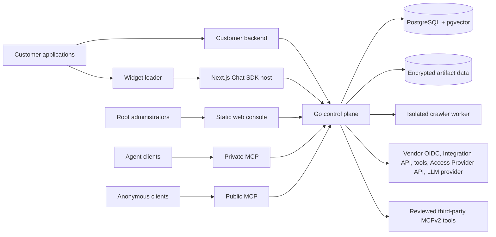
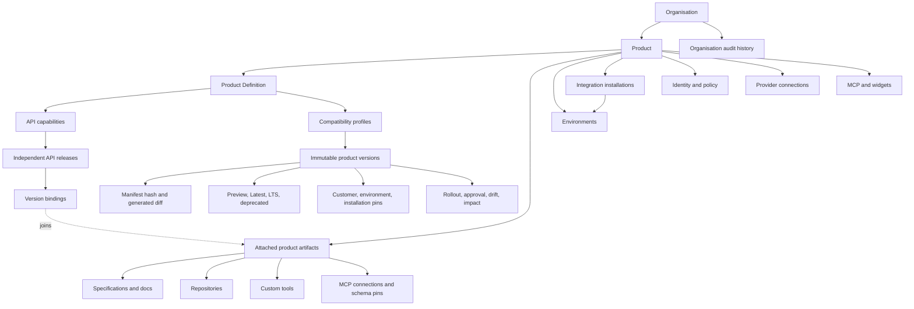

DokoSoko is one control plane with deliberately separate access surfaces.

## Runtime components

### Go control plane

The service owns administrative APIs, OAuth, MCP, publication policy, audit, analytics, and runtime authorization. It also serves the statically built web console.

### Static console

Root administrators configure organisations, deployments, integrations, sources, tools, identity, access providers, environments, and operations. Persistent integration secrets are encrypted before storage and are not returned to the browser.

### Widget delivery

The framework-neutral browser loader renders a sandboxed iframe from the Next.js widget host. The customer backend authenticates the user and uses one server-only widget secret to mint a 60-second, single-use bootstrap. The host exchanges it for a 15-minute session bound to the widget and exact application origin. Sessions remain in iframe memory. DokoSoko re-checks the active widget and selected APIs on every message before streaming the assistant response.

### PostgreSQL and artifact data

PostgreSQL stores product configuration, publication state, identity records, token digests, audit events, analytics, and vector-backed knowledge metadata. Artifact data is stored separately; both stores must be backed up together.

### Crawler worker

The crawler is an isolated Node.js process. It discovers from sitemaps first, uses Cheerio for the fast path, falls back to Playwright when necessary, and writes immutable snapshots for review. Crawl budgets, SSRF defenses, and prompt-injection scanning constrain untrusted input.

### Vendor systems

DokoSoko connects to fixed HTTPS destinations: a vendor OIDC provider and delegated customer API origin, separately authenticated backend connections, custom tool operations, an optional Access Provider API, an assistant LLM provider, and explicitly reviewed third-party MCP servers. MCP bridges are [Stateless MCPv2 Only](https://blog.modelcontextprotocol.io/posts/2026-07-28/): no logical live session is retained between calls.

## Product hierarchy

An **organisation** is the administrative and audit boundary. A **product** owns delivery configuration and attached artifacts. Its **Product Definition** joins those artifacts to independently versioned API releases and compatibility profiles. A **product version** is an immutable, hashed snapshot of one profile and definition revision, with generated diffs, rollout, approval, drift, Latest, LTS, Preview, and deprecation state. **Integration installations** map a signed external installation claim to one customer and environment. Exact installation, environment, and customer pins override channel selection in that order. Attaching establishes ownership; a version binding establishes compatibility. Incompatible commercial or semantic product lines remain separate products. Access tokens are product-bound.

## Protocol surfaces

| Surface | Audience | Main purpose |
| --- | --- | --- |
| `/api/v1/...` | Root administrators | Console and automation contract |
| `/.well-known/oauth-protected-resource/mcp` | MCP clients | Canonical Private MCP OAuth resource metadata |
| `/oauth/...` | MCP clients | OAuth 2.0 authorization code + PKCE broker |
| `/mcp` | Authenticated agent clients | Private knowledge, tools, access instances, and credentials |
| `/mcp/public` | Anonymous agent clients | Published public knowledge only |
| `/v1/widgets/{widgetId}/configuration` | Widget host | Safe presentation configuration for an active widget |
| `/v1/widget-sessions` | Authenticated customer backends | Mint a single-use bootstrap with a server-only widget secret |
| `/v1/widget-sessions/exchange`, `/v1/widget-session`, `/v1/widget-chat` | Widget host | Exchange, validate, and use short-lived widget sessions |
