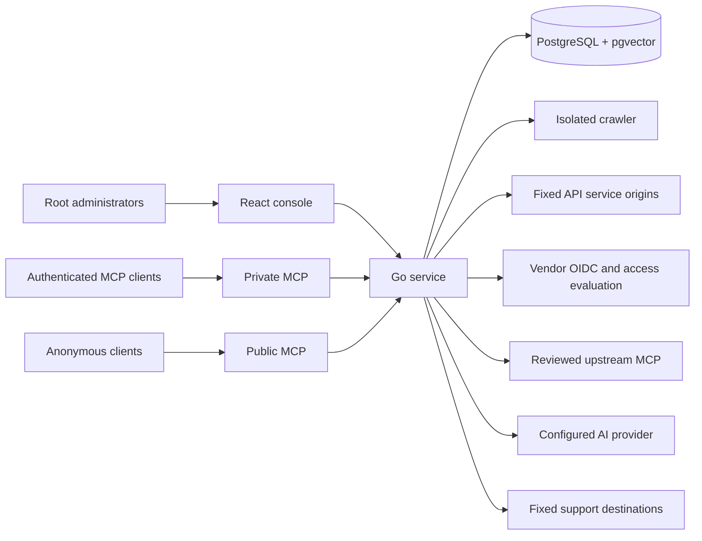
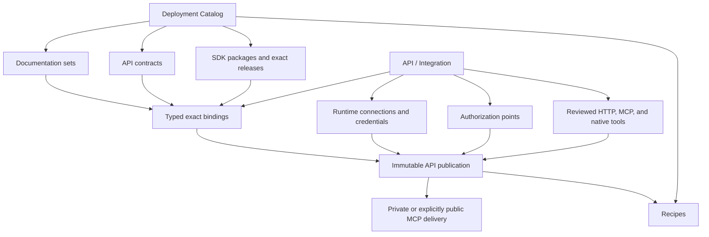

DokoSoko is one Go service with deliberately separate administrative, ingestion, and MCP trust boundaries.

## Runtime components

### Go service and console

The service owns the administrative API, root sessions, OAuth broker, MCP endpoints, publication policy, retrieval, tool admission, audit, and support outbox. It also serves the statically built console.

### PostgreSQL and uploads

PostgreSQL stores configuration, immutable publications, normalized developer assets, indexes, identity state, credential ciphertext, support submissions, and audit records. A separate private upload volume holds source uploads for the crawler. Back up the database, uploads, deployment configuration, and exact master key as one recovery set.

### Isolated crawler

The credential-free crawler acquires website, OpenAPI, and uploaded content under URL, DNS, redirect, same-origin, byte, page, and path-containment limits. It writes staged results for human review; a crawl never publishes itself.

### Connected systems

Runtime connections, OIDC, access evaluation, upstream MCP, AI, and support delivery each use an explicitly configured boundary. Agent arguments cannot choose a destination or authentication mode at call time.

## Catalog and API ownership

Documentation sets, API contracts, and SDK packages are reusable deployment-owned assets. An API owns typed bindings to exact revisions or releases. Publishing the API snapshots those exact selections plus its tool, authorization, and runtime revisions; later Catalog changes never rewrite the historical publication.

There are no product channels, Latest/LTS promotion, customer pins, staged rollout, provider-owned instances, or automatic SDK upgrades.

## Protocol surfaces

| Surface | Audience | Purpose |
| --- | --- | --- |
| `/api/v1/...` | Root administrators | Catalog, API, identity, policy, tool, and operational administration |
| `/.well-known/oauth-authorization-server` | MCP clients | DokoSoko authorization-server metadata |
| `/.well-known/oauth-protected-resource/mcp` | MCP clients | Private MCP resource metadata |
| `/oauth/...` | MCP clients | Authorization code + PKCE broker through the vendor OIDC provider |
| `/mcp` | Authenticated MCP clients | Customer-authorized resources and tools |
| `/mcp/public` | Anonymous MCP clients | Explicitly public, published, read-only material |
| `/agent-setup/{kind}/prompt.md` | Agent users | Generated private or public connection instructions |
