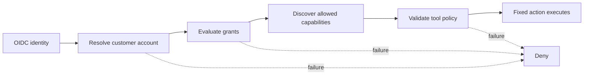
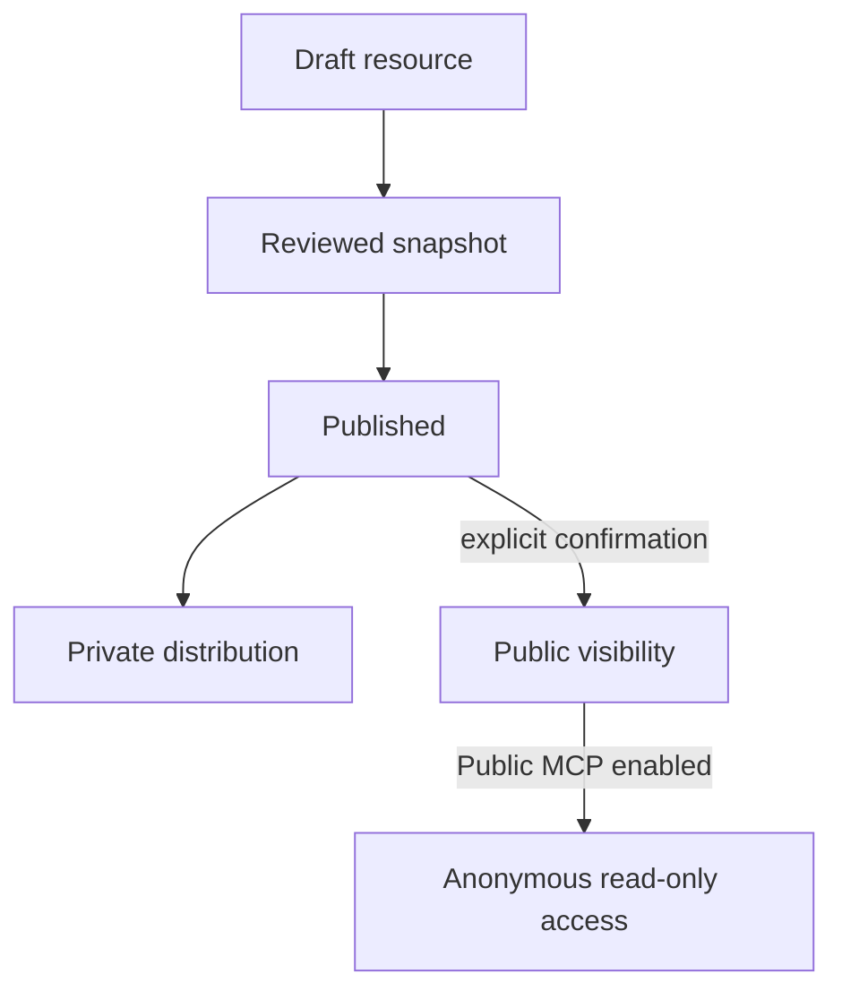

DokoSoko treats content, agent input, and connected systems as separate trust domains. Its default state is private and non-executable.

## Core boundaries

| Boundary | Guarantee |
| --- | --- |
| Root administration | Password, TOTP MFA, secure session cookies, CSRF checks, and exact-origin validation |
| Publication | Draft/published state is separate from private/public visibility |
| OAuth | Authorization code + PKCE, exact redirect allowlists, short-lived product-bound records stored by digest |
| Vendor credentials | Encrypted server-side and never forwarded to browsers or MCP clients |
| Tool execution | Fixed HTTPS destination, JSON Schema validation, grants, optional confirmation, active customer state, and audit |
| Support reporting | Private MCP only, explicit preview and confirmation, likely-secret rejection, encrypted payload holding, bounded retention, and idempotent delivery |
| Embedded widgets | Server-derived customer identity, exact-origin allow-list, one-time hashed backend secrets, single-use 60-second bootstraps, 15-minute in-memory sessions, and current-state checks on every message |
| Third-party MCP | Stateless MCPv2 Only; reviewed imports, fixed destination, closed schemas, hash pins, drift shutdown, and separate upstream credentials |
| Crawling | SSRF controls, crawl budgets, immutable snapshots, injection scanning, quarantine, review, and atomic publication |
| Public access | Disabled by default, anonymous, read-only, rate-limited, and limited to published resources marked public |

## Identity is not authorization

The vendor IdP proves who the user is and supplies the external customer identifier. DokoSoko resolves a durable customer account and the fixed vendor access-evaluation operation returns short-lived grants. Identity, account, evaluation, or tool-policy failures deny access.

## Secrets and tokens

- The inbound product-bound DokoSoko token is never sent to a vendor API.
- The inbound token is also never sent to an upstream MCP server. Delegated calls use an encrypted upstream OAuth grant bound to `issuer|subject`, with a pinned RFC 9207 authorization-server issuer; service calls use a separate encrypted connection credential.
- Vendor service credentials are encrypted with the deployment master key.
- Widget secrets are returned once and stored by digest. Bootstrap and session tokens are also stored only by digest and never belong in URLs or persistent browser storage.
- The browser cannot submit its own customer identity or select integrations. The authenticated customer backend derives identity, while the active widget configuration defines the maximum API set.
- Newly issued end-user credentials are returned once; only the fingerprint, lease metadata, expiry, and revocation state are retained.
- Audit and analytics exclude raw queries, argument values, tokens, and secret plaintext.
- Bug and feedback payloads are encrypted at rest; only bounded routing and delivery metadata remain plaintext, and expired records are deleted automatically.

## Content safety

Crawled documentation can contain instructions intended to manipulate a model. DokoSoko therefore treats retrieved content as untrusted context. LLM profiles enforce bounded inputs and outputs, citation requirements, no model authority, no model-driven tool execution, and no answer when confidence is too low.

Widget questions are also untrusted context. The assistant profile receives the current question and safe metadata for the APIs selected on the widget. Customer identifiers, provider credentials, widget secrets, internal prompts, and unrestricted destinations are excluded. The model cannot authorize a tool or expand the widget session.

## Public publication model

A resource can be published while remaining private. Anonymous availability requires publication, explicit public visibility, and Public MCP to be enabled.
