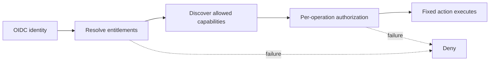
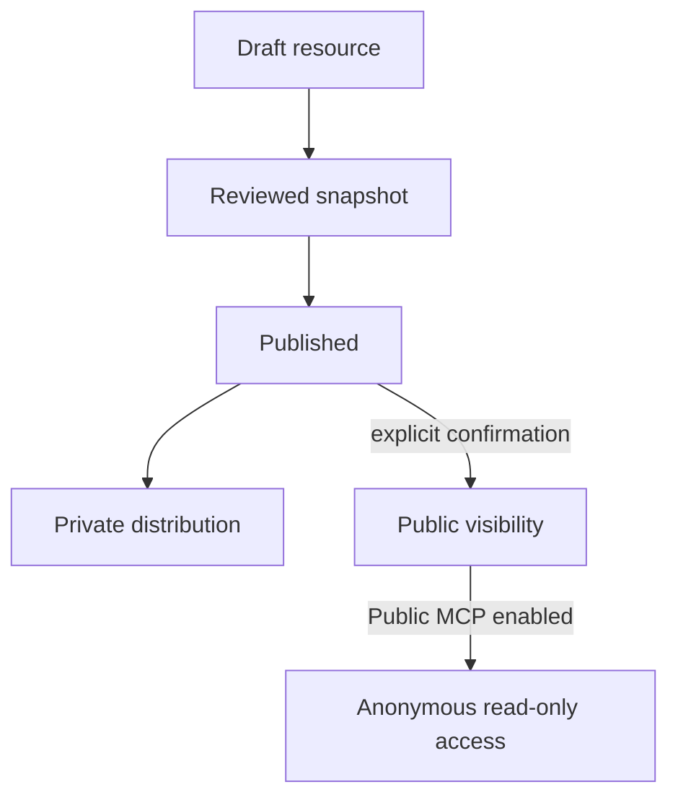

DokoSoko treats content, agent input, and connected systems as separate trust domains. Its default state is private and non-executable.

## Core boundaries

| Boundary | Guarantee |
| --- | --- |
| Root administration | Password, TOTP MFA, secure session cookies, CSRF checks, and exact-origin validation |
| Publication | Draft/published state is separate from private/public visibility |
| OAuth | Authorization code + PKCE, exact redirect allowlists, short-lived product-bound records stored by digest |
| Vendor credentials | Encrypted server-side and never forwarded to browsers or MCP clients |
| Tool execution | Fixed HTTPS destination, JSON Schema validation, entitlements, optional confirmation, per-operation authorization, and audit |
| Third-party MCP | Stateless MCPv2 Only; reviewed imports, fixed destination, closed schemas, hash pins, drift shutdown, and separate upstream credentials |
| Package delivery | DNS/IP validation, bounded downloads, redirect revalidation, and optional SHA-256 and size checks |
| Crawling | SSRF controls, crawl budgets, immutable snapshots, injection scanning, quarantine, review, and atomic publication |
| Public access | Disabled by default, anonymous, read-only, rate-limited, and limited to published resources marked public |

## Identity is not authorization

The vendor IdP proves who the user is. Entitlements narrow what the account includes. An independent authorization hook can decide whether a sensitive action is allowed now. Hook failures deny access.

## Secrets and tokens

- The inbound product-bound DokoSoko token is never sent to a vendor API.
- The inbound token is also never sent to an upstream MCP server. Delegated calls use an encrypted upstream OAuth grant bound to `issuer|subject`, with a pinned RFC 9207 authorization-server issuer; service calls use a separate encrypted connection credential.
- Vendor service credentials are encrypted with the deployment master key.
- Newly issued end-user credentials are returned once; only the fingerprint, lease metadata, expiry, and revocation state are retained.
- Audit and analytics exclude raw queries, argument values, tokens, and secret plaintext.

## Content safety

Crawled documentation can contain instructions intended to manipulate a model. DokoSoko therefore treats retrieved content as untrusted context. LLM profiles enforce bounded inputs and outputs, citation requirements, no model authority, no model-driven tool execution, and no answer when confidence is too low.

## Public publication model

A resource can be published while remaining private. Anonymous availability requires publication, explicit public visibility, and Public MCP to be enabled.
