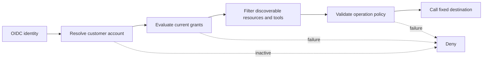
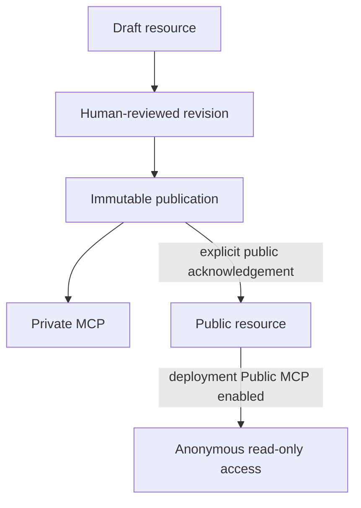

DokoSoko treats administrators, customers, agents, acquired content, model providers, and connected services as separate trust domains. A missing or ambiguous security decision fails closed.

## Core boundaries

| Boundary | Guarantee |
| --- | --- |
| Root administration | MFA-protected sessions, CSRF validation, and exact-origin checks for browser mutations |
| Publication | Draft, immutable publication, and public visibility are separate decisions |
| Developer assets | Exact revisions, hashes, selectors, review evidence, and scope filters are retained |
| OAuth | Authorization code + PKCE, resource-bound DokoSoko tokens, and current customer-state checks |
| Runtime credentials | Write-only, encrypted at rest, attached to fixed service origins, and omitted from manifests and responses |
| Tool execution | Closed schemas, fixed destination, grants, confirmation, idempotency, output validation, and audit |
| Upstream MCP | Fixed HTTPS endpoint, write-only service token, reviewed local schemas, and drift shutdown |
| Native plugins | Reviewed Go source compiled into the service; trusted application code, not a sandbox |
| Crawling | Credential-free acquisition, network and size budgets, quarantine, review, and immutable publication |
| Support reporting | Private MCP only, explicit preview and consent, likely-secret rejection, plaintext durable outbox, and bounded delivery retries |
| Public MCP | Disabled by default, anonymous, read-only, rate-limited, and restricted to explicitly public published material |

## Identity is not authorization

The vendor identity provider proves who signed in and supplies the stable customer claim. The fixed customer access-evaluation operation narrows access with short-lived grants. DokoSoko still owns the tool catalog, resource scope, confirmation, and publication checks.

## Secrets and tokens

- An inbound DokoSoko bearer token is never sent to a runtime API, access-evaluation service, or upstream MCP server.
- Runtime, OIDC, AI, HTTP-tool, and upstream MCP credentials are encrypted with the deployment master key and never returned after write.
- An upstream MCP may receive a bounded `X-DokoSoko-User` identity envelope signed with its separate service token when the connection explicitly enables it.
- Audit, retrieval traces, and sanitized tool-test evidence exclude credentials and raw payload values.
- Support reports are intentionally plaintext. Keep their schemas bounded, reject likely secrets, restrict administrative access, and apply retention at the deployment boundary.

## Content and AI safety

Source documents, SDK source, user prompts, and upstream metadata are untrusted evidence. Deterministic parsing and review remain authoritative. Advisory AI receives one bounded immutable scope, no credentials, no tools, and a closed output schema. A successful advisory can inform a later human action; it cannot approve, attach, mutate, or publish an asset.

## Public publication model

Public visibility is never inferred from publication. The deployment switch and every applicable resource-level visibility gate must all be open.
