An HTTP tool wraps one fixed upstream operation in DokoSoko's authorization and publication boundary. The agent supplies only schema-valid arguments; administrators own the destination, mappings, grants, confirmation, and limits.

For an existing MCP server, use [Import third-party MCP tools](/guides/mcp-bridges/). For reviewed in-process Go logic, use [Native tool plugins](/guides/native-tool-plugins/).

## Choose tool ownership

| Tool type | Create it from | Destination and authentication |
| --- | --- | --- |
| API-owned | The API's **Tools** section | A relative operation path inherits the API's fixed base URL, Authorization method, and encrypted credential |
| Common | **Tools → Catalog → Create HTTP tool** | The tool owns an independent fixed endpoint, authentication method, and write-only credential |

An API-owned tool cannot store a second origin or independent credential. Use it for operations that belong to the API's shared runtime Authorization. Use a common tool for a fixed service that is intentionally reusable across APIs.

## Build the draft

Define:

- a stable namespace, name, title, and action-focused description;
- closed object input and output JSON Schemas;
- a relative operation path for an API-owned tool, or one fixed credential-free endpoint for a common tool, plus the HTTP method;
- explicit request and response mappings;
- for a common tool, the upstream authentication type and any write-only credential;
- effect, identity requirement, grants, confirmation, idempotency, timeout, and size limits.

Keep schema objects bounded and set `additionalProperties: false` unless an intentionally open object is essential. Use enums, length limits, numeric bounds, and explicit required fields.

:::caution[Arguments cannot choose the destination]
Tool arguments can fill only the reviewed mapping. They cannot replace the host, path template outside that mapping, method, token endpoint, authentication mode, or credential. API-owned tools resolve those values from the bound API Authorization.
:::

## Import or use advisory help

The Tool Builder can parse pasted cURL, Postman Collection, or OpenAPI text into reviewable candidates. It does not fetch a caller-supplied OpenAPI URL and removes detected credential material.

The configured Analysis workload can propose or analyse a draft. Every change remains a field-level proposal. Deterministic validation is authoritative; AI cannot remove an error, save a tool, contact the endpoint, bind it to an API, or publish it.

## Validate without a network call

Run **Contract check** first. It normalizes the draft, validates schemas, mappings, policy, credential presence, and the fixed destination without resolving DNS or making an upstream request.

Resolve every error before a live test. Warnings should be reviewed rather than mechanically dismissed.

## Run a controlled live test

Live HTTP tests operate on one exact draft revision and the persisted fixed destination. Mutations require policy-enforced idempotency plus a short-lived confirmation bound to the canonical arguments. Delegated OAuth tools cannot be live-tested by a root administrator because that route never accepts an end-user token.

DokoSoko retains only short-lived sanitized structural evidence: status, duration, value-free JSON shapes, and bounded finding codes. It discards raw bodies, headers, scalar values, credentials, destination details, nonces, and idempotency keys.

An administrator may explicitly consent to send that sanitized evidence to the configured Analysis provider. The result remains advisory.

## Publish and bind

Publishing creates an immutable tool revision. In the API's **Tools** section, manage API-owned tools separately from attached common tools and bind the exact tool revision with an exact active action-policy revision. Run API preflight, then publish a new API snapshot. See [Define authorization policies](/guides/authorization-policies/) for grants, action types, TTLs, and confirmation.

Changing a published tool requires cloning it into a new draft. Retiring a tool makes existing exact bindings unresolved; remove or replace them before publishing the API again.

## Execution order

```mermaid
flowchart LR
    Call[Tool call] --> Publication[Resolve exact published revision]
    Publication --> Identity[Check identity and customer state]
    Identity --> Grants[Check grants and authorization point]
    Grants --> Input[Validate input and confirmation]
    Input --> Destination[Resolve fixed destination and credential]
    Destination --> Upstream[Make bounded upstream call]
    Upstream --> Output[Validate output and record audit]
```

Any identity, publication, grant, confirmation, schema, destination, credential, transport, or output failure denies the operation.
