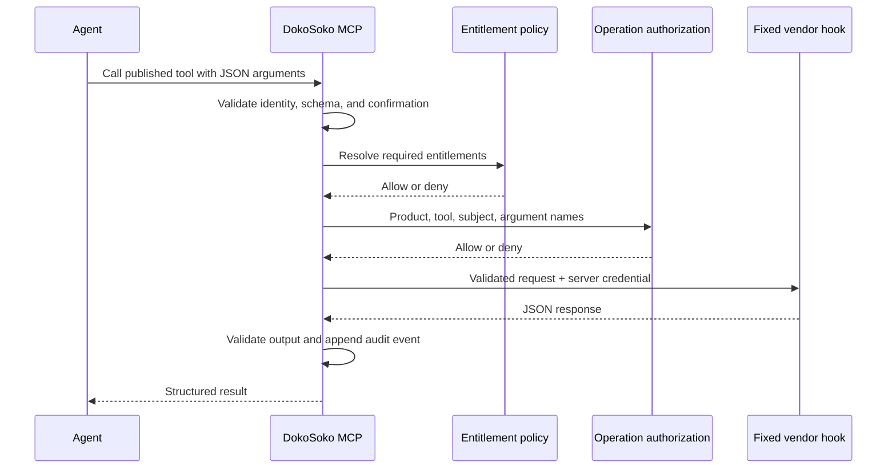

Custom tools wrap vendor HTTP operations in a narrow policy boundary. The model discovers a documented tool and supplies structured input; DokoSoko retains control of the destination, credentials, authorization, confirmation, validation, and audit.

To bring in selected operations from an existing MCP server, use the managed [third-party MCP import workflow](/guides/mcp-bridges/) instead. Imported tools receive the same local policy and publication boundary.

## Configure a custom MCP tool

1. **Open the tool inventory.**

   Select the product, open **Tools**, and choose **Create tool**. Existing tools show whether they are still drafts or have been published to Private MCP.

   

2. **Define the MCP identity.**

   Enter a stable namespace, tool name, and action-focused description. MCP clients discover the tool as `namespace.name`, so treat the full name as a public API:

   | Field | Example | Guidance |
   | --- | --- | --- |
   | Namespace | `projects` | Group related operations under one short, stable prefix. |
   | Tool name | `create_ephemeral_sandbox` | Use lower-case snake case and describe one operation. |
   | Description | `Create a short-lived developer sandbox in an approved region.` | State the effect and important limits for the agent. |

3. **Add the input and output contracts.**

   Both schemas must have an object root. Set `additionalProperties` to `false`, bound strings and numbers, use enums for controlled choices, and list every value the operation requires.

   ```json title="Input JSON Schema"
   {
     "type": "object",
     "additionalProperties": false,
     "properties": {
       "name": { "type": "string", "minLength": 3, "maxLength": 50 },
       "region": { "type": "string", "enum": ["us-east-1", "eu-west-1"] },
       "ttl_seconds": { "type": "integer", "minimum": 900, "maximum": 86400 }
     },
     "required": ["name", "region", "ttl_seconds"]
   }
   ```

   ```json title="Output JSON Schema"
   {
     "type": "object",
     "additionalProperties": false,
     "properties": {
       "sandbox_id": { "type": "string" },
       "status": { "type": "string", "enum": ["creating", "ready"] },
       "expires_at": { "type": "string", "format": "date-time" }
     },
     "required": ["sandbox_id", "status", "expires_at"]
   }
   ```

4. **Bind the fixed API action and policy.**

   Select the HTTP method and enter one fixed HTTPS hook URL. Add a service credential only when the endpoint requires bearer authentication; DokoSoko encrypts it and never exposes it to the MCP client. Enter comma-separated entitlement keys that must all be enabled for discovery and execution.

   

   :::caution[The agent cannot choose the destination]
   Tool arguments become validated query parameters for `GET` or a JSON body for other methods. They cannot replace the configured host, path, HTTP method, or authorization header.
   :::

5. **Save and validate the draft.**

   Choose **Save draft**. DokoSoko rejects invalid JSON, unsupported schemas, unsafe destinations, and malformed policy configuration. Before publishing, test the fixed endpoint independently with representative success, denial, timeout, and invalid-output responses.

6. **Publish the tool to Private MCP.**

   Find the new draft in the tool inventory and choose **Publish**. Publication creates an immutable runtime release; changing the definition later requires another reviewed release.

   

7. **Verify discovery and execution.**

   Reload tools in an authenticated MCP client and confirm `projects.create_ephemeral_sandbox` appears for an entitled test account but is absent for a user without `sandboxes.create` or `developer.pro`. Run a non-production call, validate the structured response, and confirm the execution appears in **Activity & audit** without arguments or credential plaintext.

## Define the contract

Create a tool with:

- a stable name and description written for an agent;
- JSON Schema input and output contracts;
- one fixed HTTPS hook destination;
- an encrypted service credential, if the hook requires one;
- required vendor entitlements;
- a confirmation policy for consequential actions;
- draft or published lifecycle state.

Schemas must use an object root with `additionalProperties: false`. DokoSoko rejects oversized or excessively complex schemas, remote references, more than 10 levels of nesting, and more than 64 properties. Keep each schema under 64 KiB.

## Execution flow



Argument values and the inbound DokoSoko token are not sent to the authorization hook. Policy or hook failures deny execution.

See [Vendor hook contracts](/reference/vendor-hooks/) for the external authorization payload and custom tool transport rules.

## Design effective tools

- Make one tool represent one stable operation.
- Use enums and bounded strings instead of free-form payloads.
- Require confirmation for writes, deletions, purchases, or other material effects.
- Return identifiers and next actions rather than large unstructured responses.
- Test deny, timeout, invalid-output, and credential-failure paths before publishing.

:::note
Use the standard Provider API for project creation and credential leases. Use custom tools for vendor-specific actions that do not fit that lifecycle.
:::
