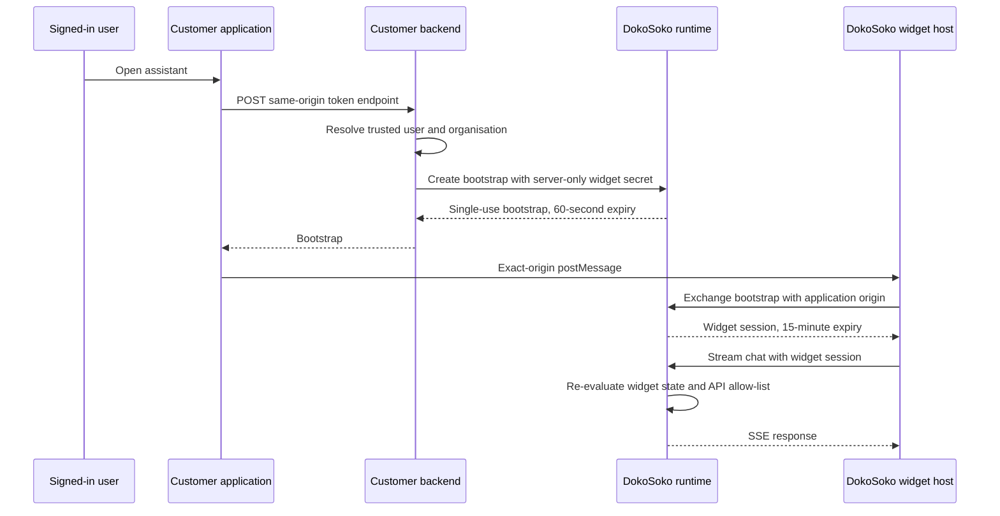

A DokoSoko widget is an authenticated assistant embedded in your customer application. Your backend remains responsible for identifying the signed-in user. DokoSoko turns that trusted identity into a short-lived session constrained to one widget, one exact application origin, and the APIs selected by an administrator.

The browser never receives the widget secret, a vendor credential, or permission to choose an API.

## How authentication works



The bootstrap is single-use. The widget session stays in iframe memory and is never placed in a URL, cookie, local storage, or session storage. When it expires, the loader asks your backend for a fresh bootstrap.

## Before you start

You need:

- at least one API in DokoSoko;
- an enabled **assistant** LLM profile in **Settings**;
- an authenticated server endpoint in your customer application;
- the browser package `@dokosoko/widget`;
- the server-only package `@dokosoko/widget-backend`;
- a deployed DokoSoko widget host, or the managed `https://widget.dokosoko.com` host.

:::caution[The assistant profile is a launch requirement]
DokoSoko will not activate a widget without an enabled assistant profile and encrypted provider credential. The server-side agent selects only recipes and documentation pinned to the allowed APIs, then supplies that bounded context and short session history to the model. It does not supply widget secrets, customer user IDs, customer organisation IDs, or vendor credentials.
:::

## 1. Create the widget

Open **Agent access → Widgets**, then select **Create widget**.

Configure:

1. **Name** — the customer-facing assistant name.
2. **Allowed origins** — exact application origins, one per line. Use HTTPS in production. Wildcards, paths, queries, fragments, and embedded credentials are rejected. `http://localhost` is accepted for development.
3. **Allowed APIs** — the smallest set of APIs the assistant should be able to discuss.

When the widget is activated, DokoSoko also pins the exact current recipe revisions scoped to those APIs. Publish at least one concise setup recipe before launch if customers will ask onboarding questions. After publishing a new recipe revision, choose **Refresh guidance** on the widget; active widgets never follow mutable guidance silently. If source or contract drift makes a recipe outdated, the widget keeps its last pinned revision and shows **Review guidance** instead of silently replacing or deleting it.

Creation returns a `doko_wsk_...` widget secret once. Save it in the customer backend's secret manager. DokoSoko stores only its digest and a non-secret fingerprint.

:::danger[Never expose the widget secret]
Do not place the secret in browser code, a `NEXT_PUBLIC_` variable, rendered HTML, analytics, logs, or a mobile application. Rotate it immediately if it might have been exposed.
:::

## 2. Add the backend endpoint

Install the server SDK:

```bash
npm install @dokosoko/widget-backend
```

Create a same-origin endpoint that authenticates the caller and derives identity from the trusted server session. This Next.js App Router example deliberately ignores user and organisation values from the request body:

```ts
import DokoSokoWidgetBackend from "@dokosoko/widget-backend";

const dokosoko = new DokoSokoWidgetBackend({
  widgetSecret: process.env.DOKOSOKO_WIDGET_SECRET!,
  baseURL: process.env.DOKOSOKO_API_URL!,
});

export async function POST(request: Request) {
  const user = await requireAuthenticatedUser(request);

  const bootstrap = await dokosoko.widgetSessions.create(
    {
      widgetId: process.env.DOKOSOKO_WIDGET_ID!,
      userId: user.id,
      organizationId: user.organizationId,
      origin: new URL(request.url).origin,
    },
    { idempotencyKey: crypto.randomUUID() },
  );

  return Response.json(bootstrap, {
    headers: { "cache-control": "no-store" },
  });
}
```

For a self-hosted DokoSoko service, set `baseURL` to its exact HTTPS origin. The SDK rejects credentials, paths, queries, fragments, and non-local HTTP URLs before sending the secret. It times out after 10 seconds by default and retries `408`, `429`, and `5xx` responses up to twice. It does not retry authorization or conflict responses.

Use a stable idempotency key when your application may retry the same logical request. Never reuse a key to represent a different user, organisation, origin, or widget.

## 3. Mount the browser widget

Install the framework-neutral loader:

```bash
npm install @dokosoko/widget
```

Mount it from client-side code:

```ts
import { mountWidget } from "@dokosoko/widget";

const widget = mountWidget({
  widgetId: "YOUR_WIDGET_ID",
  getToken: async () => {
    const response = await fetch("/api/dokosoko/widget-token", {
      method: "POST",
      credentials: "same-origin",
    });

    if (!response.ok) throw new Error("Sign in required");
    return response.json();
  },
});

widget.on("error", (error) => {
  // Report a bounded error category. Do not log tokens.
  console.error("Widget unavailable", error);
});
```

`mountWidget` returns `open()`, `close()`, `destroy()`, and `on()` methods. Events are `ready`, `open`, `close`, `error`, and `sessionExpired`.

The configured widget name, launcher position, and accent colour are used by default. You can override the label or position in `mountWidget`, but authorization and API selection always come from DokoSoko.

If you self-host the Next.js widget host, pass its exact origin:

```ts
mountWidget({
  widgetId: "YOUR_WIDGET_ID",
  host: "https://assistant.example.com",
  getToken: () => fetch("/api/dokosoko/widget-token", {
    method: "POST",
    credentials: "same-origin",
  }).then((response) => response.json()),
});
```

## 4. Deploy the widget host

The widget host lives in `dokosoko-widget-sdk/apps/widget-host`. It uses Next.js, the Chat SDK Web adapter, and the AI SDK transport.

Configure:

| Variable | Required | Purpose |
| --- | --- | --- |
| `DOKOSOKO_API_URL` | Yes | Exact origin of the DokoSoko runtime. HTTPS is required outside localhost. |
| `POSTGRES_URL` | Production | Durable Chat SDK state. If omitted, the host uses disposable in-memory state. |
| `WIDGET_STATE_PREFIX` | No | Namespace for widget-host state; defaults to `dokosoko-widget`. |

The host exposes:

- `/embed/:widgetId` for the sandboxed iframe;
- `/api/session/exchange` for the single-use bootstrap exchange;
- `/api/chat` for Chat SDK messages.

Serve the host over HTTPS and keep its origin stable. The loader accepts only a credential-free origin and uses exact `postMessage` origin and iframe-source checks.

## 5. Activate and verify

Return to the widget workspace and complete the five setup checks:

1. an allowed application origin exists;
2. at least one active backend secret exists;
3. at least one API is selected;
4. an assistant LLM profile is enabled;
5. the installation works from the real application origin.

Select **Go live** only after testing the complete sign-in flow. Activation fails closed if an assistant profile or API connection is unavailable.

Verify all of the following:

- signed-out users cannot obtain a bootstrap;
- a bootstrap from one origin cannot be exchanged by another;
- refreshing or reopening the assistant gets a new short-lived session;
- disabled widgets stop existing sessions immediately;
- removing an API prevents subsequent messages from using it;
- secrets and tokens do not appear in URLs, storage, logs, analytics, or error messages;
- the assistant does not claim that it changed data or called an API when no tool result exists.
- setup questions cite and follow the expected published recipe;
- Markdown lists, code blocks, and paragraphs render correctly;
- follow-up questions retain the selected API and recipe for the current session;
- **Why this answer?** in admin preview shows only the expected recipe and documentation sources.

## Rotate credentials and revoke sessions

Create a second backend secret before replacing the first one. Deploy the new secret, confirm successful bootstrap creation, and then revoke the old secret. The console prevents revoking the only active secret.

Revoking a backend secret stops new bootstraps made with that credential. Revoke a customer session separately when access must end immediately. Disabling the widget revokes all of its active sessions.

## Runtime errors

The runtime returns a structured error and an `X-Request-ID`. The backend SDK exposes these as `DokoSokoWidgetError.status`, `.code`, `.requestId`, and `.details`.

| Code | Meaning | Action |
| --- | --- | --- |
| `widget_authentication_failed` | Secret, bootstrap, or session is invalid or expired | Request a new bootstrap; rotate a suspected secret |
| `widget_origin_denied` | The application origin is not on the widget allow-list | Save the exact browser origin in the widget workspace |
| `widget_disabled` | The widget is not active | Review setup and reactivate it |
| `widget_has_no_active_integrations` | No selected API is currently active | Activate an allowed API or update the widget selection |
| `widget_assistant_unavailable` | The assistant profile or provider is unavailable | Check the assistant profile, credential, provider endpoint, and budget |

Do not show raw upstream failures to customers. Log the request ID and a bounded error category, then present a generic retry message.

## Runtime API and generated SDKs

The [Widget Runtime API explorer](/api/widget-runtime/) and [OpenAPI YAML](/widget-runtime-openapi.yaml) are the canonical wire contract. Generate clients from this contract rather than copying JSON shapes from the examples above.

The TypeScript backend package currently generates checked-in types with `openapi-typescript`. The service also includes a checked-in Stainless configuration for the eventual published SDK. Keep the contract as the source of truth: generated code may add transport ergonomics, but it must not redefine authentication, identity, origin, or session semantics.

## Migrating from the old snippets

The unauthenticated `public.js` and OAuth-backed `private.js` loaders no longer exist. The old `/widgets/{product}/public.js` and `/api/v1/products/{product}/widgets` routes return `404`.

Remove the old script tag and product-specific widget configuration. Create a widget resource, save its one-time server secret, add the authenticated backend endpoint, and mount `@dokosoko/widget`. There is intentionally no compatibility alias: silently preserving the old loader would preserve its weaker trust boundary.
