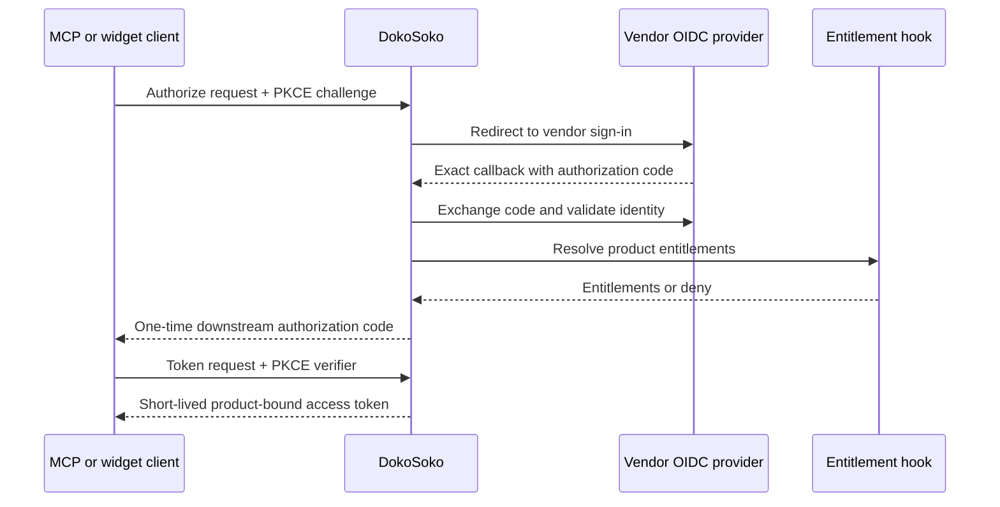

Private MCP and private widgets authenticate through DokoSoko’s OAuth broker. The vendor remains the identity authority; DokoSoko issues its own short-lived, product-bound access token after identity and entitlement checks succeed.

## Configure OIDC

Provide the product with:

- the vendor issuer and authorization, token, and user-info endpoints;
- an OIDC client ID and encrypted client secret;
- exact downstream redirect URI allowlist entries;
- the entitlement hook destination and service credential;
- an optional independent operation-authorization hook.

Open **Settings → Vendor identity → Configure identity** and enter the values in one product-scoped configuration. Secret and authorization credential fields are write-only; leaving them blank in the example below prevents accidental disclosure.


Wildcards are not accepted in redirect URIs. Outside local development, all integration destinations must use HTTPS.

Use the [Vendor Hooks interactive explorer](/api/vendor-hooks/) and [contract guide](/reference/vendor-hooks/) for the exact entitlement and per-tool authorization payloads.

## Authorization-code flow



Authorization codes and access tokens are stored by digest, expire quickly, and cannot cross products.

## Keep policy layers distinct

Identity answers **who is this user?** Entitlements answer **what does their vendor account include?** The operation-authorization hook answers **may this user perform this particular sensitive action now?**

Both policy hooks fail closed. Keep them fast, observable, and independently testable. Avoid copying vendor business rules into DokoSoko; return stable entitlement identifiers that product resources can require.

## Register the callback

Register this callback at the vendor IdP:

```text
https://YOUR_DOKOSOKO_ORIGIN/oauth/callback/PRODUCT_ID
```

Then configure each permitted client callback as an exact downstream redirect URI in the product’s identity settings.
