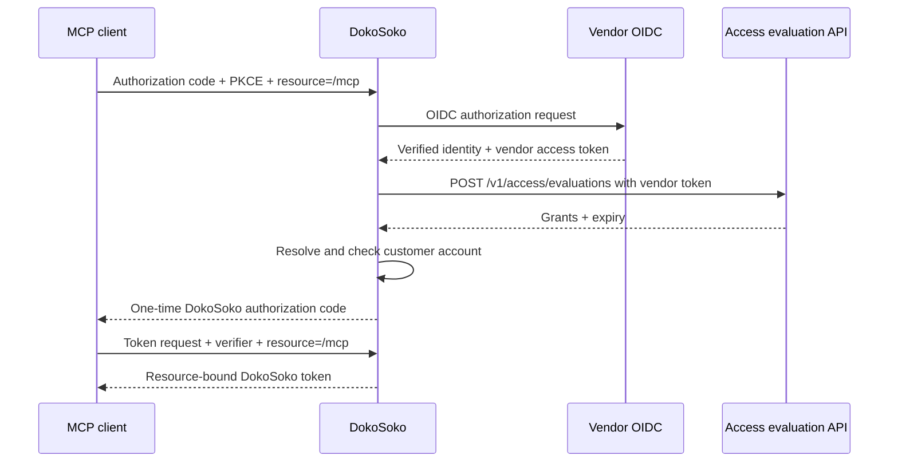

Private MCP authenticates through DokoSoko’s OAuth server. The vendor remains the identity authority; DokoSoko issues its own short-lived token only after the current customer and access checks succeed.

## Configure the identity provider

Open **Identity & customer accounts** and configure:

- the exact HTTPS OIDC issuer;
- client ID and write-only encrypted client secret;
- scopes plus optional authorization audience or RFC 8707 resource;
- the required ID-token claim containing the stable external customer ID;
- the fixed credential-free authorization API origin.

DokoSoko appends `POST /v1/access/evaluations` to that origin. It does not accept arbitrary per-operation authorization URLs.

Register this exact callback with the provider:

```text
https://YOUR_DOKOSOKO_ORIGIN/oauth/callback
```

Save the draft, run a real OIDC test sign-in, and activate only the exact tested configuration revision.

## Authorization-code flow



DokoSoko publishes authorization-server metadata at `/.well-known/oauth-authorization-server` and protected-resource metadata at `/.well-known/oauth-protected-resource/mcp`.

## Access-evaluation contract

The request body is an empty object. The delegated vendor token—not caller-supplied fields—identifies the user and customer. The response returns bounded stable grant keys and an explicit expiry.

Use the [Customer Identity Integration API guide](/reference/vendor-integration-api/) and [read-only explorer](/api/identity-integration/) when implementing this operation.

## Customer accounts and grants

DokoSoko resolves `(issuer, external customer ID)` to one durable customer account after verified login. Administrators may suspend or reactivate that account; they do not create identity-backed accounts manually. Suspension is checked when an existing token is used.

OIDC establishes identity. Access evaluation narrows current grants. DokoSoko still owns resource scope, authorization points, tool definitions, and confirmation policy. A timeout, denial, malformed or expired evaluation, missing customer claim, inactive account, or grant failure denies access.

The delegated vendor token is used only for the fixed access-evaluation request. The resulting DokoSoko token is never forwarded to vendor services.
