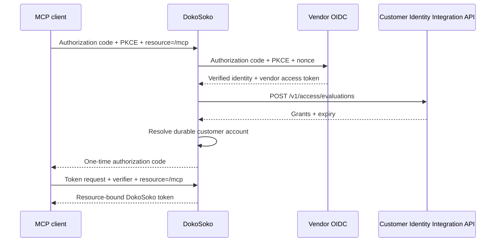

Private MCP authenticates through DokoSoko's OAuth server. The vendor remains the identity authority; DokoSoko issues its own short-lived, resource-bound token after customer identity and access checks succeed.

Embedded widgets use a different boundary: the customer application authenticates its own user, and its trusted backend creates a short-lived widget bootstrap with a widget-scoped server secret. Do not route widgets through the MCP OAuth flow. See [Embed an authenticated widget](/guides/embedded-widgets/).

## Configure the vendor connection

Open **Settings → Identity & customer accounts** and provide:

- the exact HTTPS vendor OIDC issuer;
- an OIDC client ID and encrypted client secret;
- scopes and an optional audience;
- the claim containing the stable external customer ID;
- an optional claim containing a stable installation ID;
- one credential-free vendor API origin;
- the stable vendor integration ID sent to access evaluation.

DokoSoko appends `POST /v1/access/evaluations` to the configured origin. The form does not accept an entitlement URL, usage URL, authorization URL, or arbitrary per-operation callbacks.

The vendor OIDC callback is exact:

```text
https://YOUR_DOKOSOKO_ORIGIN/oauth/callback
```

Wildcards are not accepted. Outside local development, the issuer and vendor API origin must use HTTPS.

Use the [Customer Identity Integration API explorer](/api/identity-integration/) and [contract guide](/reference/vendor-integration-api/#customer-access-evaluation) for the request, response, idempotency, and failure contract.

## Authorization-code flow



DokoSoko publishes authorization-server metadata at `/.well-known/oauth-authorization-server` and protected-resource metadata at `/.well-known/oauth-protected-resource/mcp`. Clients use the exact `/mcp` resource. Authorization and token requests require RFC 8707 resource binding and PKCE S256.

## Customer accounts

The configured OIDC organisation claim is a vendor-owned external customer ID. DokoSoko resolves `(issuer, external_customer_id)` to a stable internal `customer_account` resource just in time after verified login.

Administrators can list, suspend, and reactivate those accounts. They cannot create identity-backed accounts manually. Installations and version pins reference the internal account ID, never the external ID. A signed installation claim must match an active installation registered to that account; unknown or cross-account values fail closed.

Suspension is checked every time an existing token is used, so it does not wait for token expiry.

## Keep identity and grants distinct

OIDC answers who the user and external customer are. The access evaluation returns which stable grants are currently active. DokoSoko defines tools and their `required_grants`; the vendor does not return tool definitions.

The evaluation expiry limits the DokoSoko token lifetime. Network errors, non-success statuses, invalid responses, missing customer identity, expired results, and suspended accounts all deny authorization.

The vendor access token is encrypted and may be used for fixed vendor tool operations. The inbound DokoSoko token is never forwarded.
