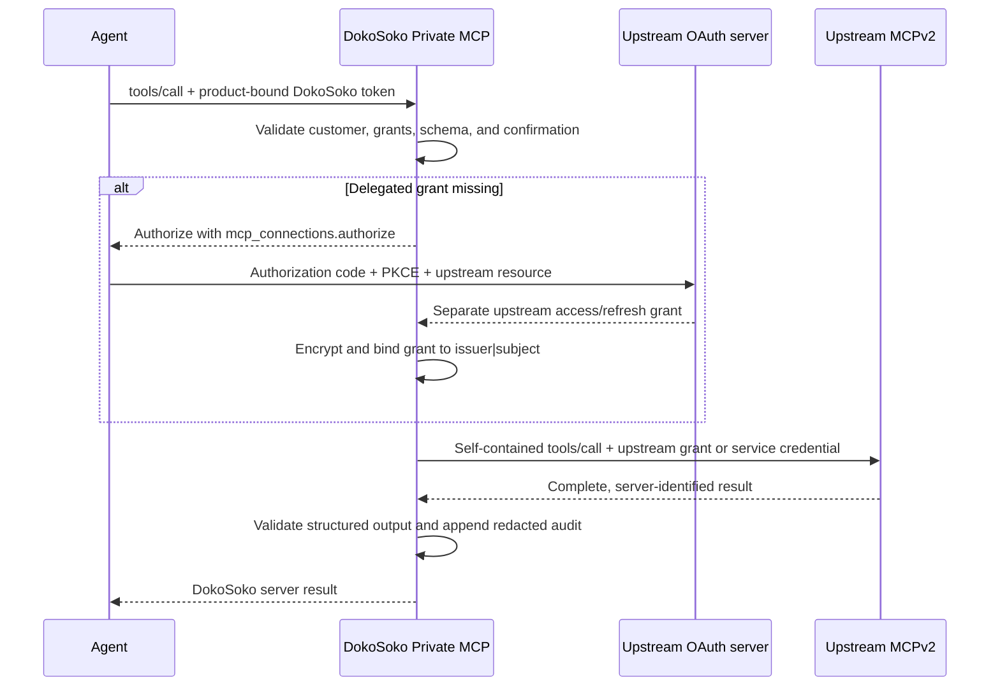

DokoSoko can expose selected tools from a third-party MCP server inside the product’s Private MCP. This is a managed import, not a transparent network proxy: every upstream tool becomes a namespaced local definition with a pinned schema, DokoSoko authorization policy, draft/publish lifecycle, and audit trail.

## Stateless MCPv2 Only

Managed upstreams and DokoSoko’s own MCP endpoints implement **[Stateless MCPv2 Only](https://blog.modelcontextprotocol.io/posts/2026-07-28/)**, fixed to protocol revision `2026-07-28`.

- Every JSON-RPC request is a self-contained HTTP `POST` with protocol, method, and tool-name metadata in the required headers and `_meta` fields.
- There is no `initialize` handshake, logical MCP session, resumable subscription, or persisted upstream session ID.
- A request may receive a bounded, request-scoped SSE response, but DokoSoko waits only for that request’s final result.
- Catalog and tool results must declare `resultType: "complete"`; incomplete or older-protocol responses fail closed.
- Every upstream response must identify its MCP server in result `_meta`.

This keeps bridge state limited to reviewed configuration, schema pins, encrypted credentials, delegated OAuth grants, and audit records. It does not keep a live upstream connection between agent calls.

## Connect and import an upstream

1. Open **MCP connections** and choose **Connect MCP**.
2. Enter a display name, a local namespace, and one fixed HTTPS endpoint. Only the default HTTPS port is accepted; redirects and private, loopback, link-local, or otherwise unsafe resolved addresses are denied.
3. Choose how DokoSoko authenticates to the upstream:

   | Mode | Use when | Credential sent upstream |
   | --- | --- | --- |
   | **Delegated OAuth per user** | The upstream must act as the signed-in developer | A separate encrypted OAuth grant bound to that DokoSoko subject |
   | **Service credential** | Every authorized caller operates through one vendor-owned service identity | The connection’s encrypted bearer credential |
   | **No upstream credential** | The upstream endpoint is intentionally unauthenticated | None |

   Delegated mode also requires the authorization server's exact issuer. DokoSoko pins it to the connection and rejects the callback unless its RFC 9207 `iss` value matches before code redemption.

4. Choose **Connect & inspect**. DokoSoko calls `tools/list` with the strict v2 contract and requires one complete catalog.
5. Review the untrusted tool names, descriptions, annotations, and schemas. Check only the tools that should enter this product.
6. Add required DokoSoko grants and keep confirmation enabled for consequential operations.
7. Import the selection. Each accepted tool is namespaced, normalized to a closed object input schema, schema-hashed, and saved as a local draft.
8. Review and publish each draft from **Tools**. Nothing is published merely because it exists upstream.

:::caution[Upstream annotations are not policy]
DokoSoko stores annotations for review but never treats them as authorization, safety, or confirmation decisions. Local policy remains authoritative.
:::

## How user identity reaches the upstream

The inbound DokoSoko access token is never forwarded. DokoSoko first authenticates that token, resolves the customer account and grants, and validates the tool input and confirmation. Only after those checks pass does it choose an upstream credential.

For delegated OAuth, the `mcp_connections.authorize` built-in tool returns a ten-minute authorization URL using authorization code + PKCE, an exact DokoSoko callback, and the upstream MCP endpoint as the OAuth resource. The callback must include the configured RFC 9207 issuer before DokoSoko will redeem its code. Access and refresh tokens are encrypted and keyed by the upstream connection plus the canonical DokoSoko subject (`issuer|subject`). Another user cannot reuse the grant.

For service mode, every entitled caller uses the connection’s encrypted upstream service token. The upstream sees the service identity, not the end user. Use this only when that accountability model is acceptable.

## Runtime authorization order

An imported call reaches the network only after all of these checks succeed:

1. the tool is published and its pinned upstream schema has not drifted;
2. the caller can discover the tool through required grants;
3. arguments satisfy the pinned closed JSON Schema;
4. required confirmation is present;
5. the customer account and installation are still active;
6. the connection is active and an appropriate upstream credential exists.

The upstream destination, protocol revision, method, tool name, and authorization header are server-controlled. Arguments cannot change them.

## Re-inspection and schema drift

Use **Inspect & import** whenever the upstream catalog changes. If a draft’s schema changed, DokoSoko updates that draft for another review. If a published tool changed, DokoSoko marks it **Schema drift**, removes it from discovery, and denies execution. Re-review the new schema before creating a new published release.

DokoSoko audits connection creation, catalog import, user-grant connection, publication, drift, and execution. It records identifiers, policy outcomes, protocol/auth modes, and timestamps—not tool arguments, results, DokoSoko tokens, or upstream credential plaintext.
