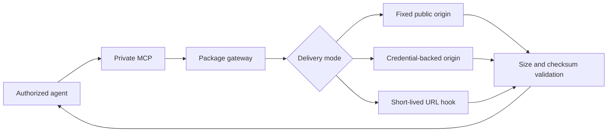

DokoSoko presents SDK packages to agents without exposing upstream credentials. Package records support npm, Go, Git, Maven/Java, Android, Swift, and NuGet/C# ecosystems.

## Select a delivery mode

| Mode | Best for | Runtime behavior |
| --- | --- | --- |
| **Public** | Public, stable artifacts | Returns or streams a fixed public URL |
| **Proxy** | Private registries with a service credential | Authenticates to a fixed upstream and streams the response |
| **Fetch** | Vendors that mint expiring download links | Calls a fixed hook, validates the returned URL and metadata, then streams the artifact |

Proxy and fetch credentials are encrypted server-side. They are never included in the console response or MCP output.

Fetch-mode implementers can use the [Vendor Hooks interactive API explorer](/api/vendor-hooks/) or [OpenAPI contract](/hooks-openapi.yaml) for the request and response schema.

## Configure a package

1. Open **Packages** for the product.
2. Choose the ecosystem and package coordinates agents should see.
3. Select a delivery mode and provide its fixed HTTPS destination.
4. For private delivery, add the service credential.
5. Add the expected SHA-256 digest and byte size when available.
6. Save, validate, and publish the package.

:::note[Why the example cannot be submitted]
The screenshot deliberately leaves **Upstream credential** empty, so **Add package** remains disabled. Enter the real service credential only in your own console; it is encrypted before storage and never returned to the browser or an agent.
:::

After saving, verify the inventory shows the expected ecosystem, delivery mode, and private visibility. Publish and change visibility only after the gateway has successfully validated a representative artifact.

## Integrity and network controls

Before an artifact reaches a caller, DokoSoko applies bounded download sizes, DNS and IP validation, redirect restrictions, and configured checksum and size checks. A validation failure stops the stream.

Like sources, packages begin private and unpublished. Marking a package public has no anonymous effect until the product’s Public MCP surface is also enabled.
