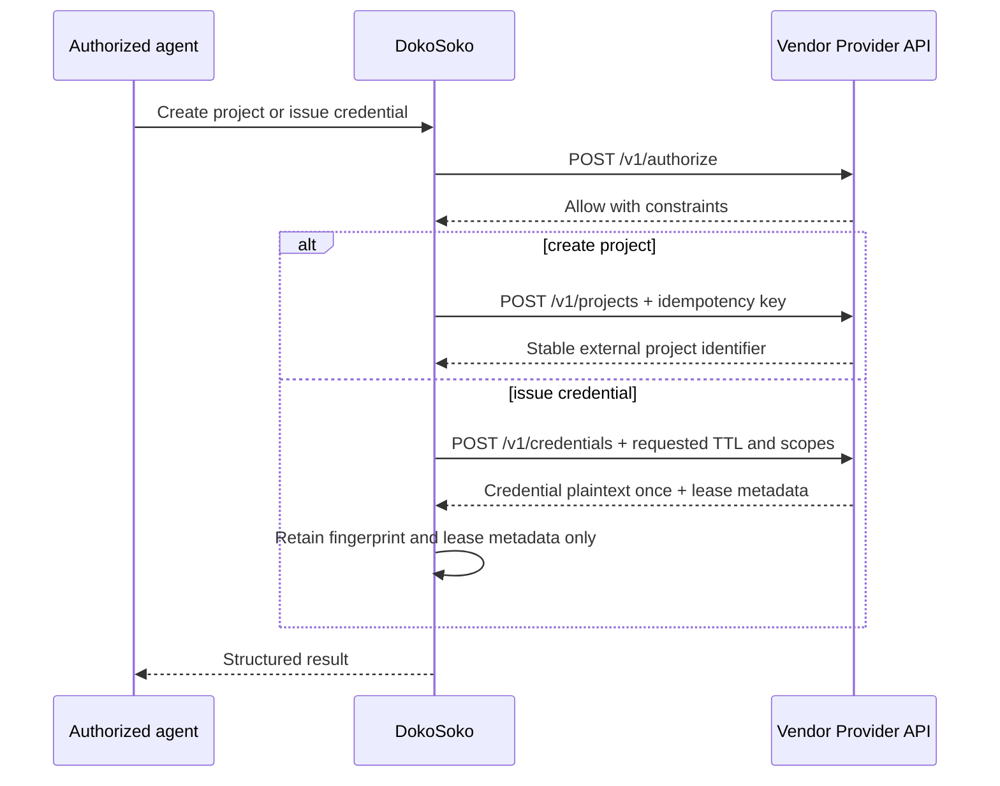

The Provider API is a small, versioned HTTPS contract implemented by the vendor. DokoSoko calls it with a separately encrypted service credential; it never forwards the caller’s DokoSoko access token.

Start from the [read-only Provider API explorer](/api/provider/) or [machine-readable contract](/provider-openapi.yaml), then use the [Provider API reference](/reference/provider-api/) for payload examples and conformance rules.

## Required operations

```text
POST /v1/authorize
POST /v1/projects
POST /v1/credentials
POST /v1/credentials/{credential_id}/revoke
```

Every mutation is preceded by `POST /v1/authorize`. If authorization is unavailable or returns a denial, the operation stops.



## Contract requirements

- Scope requests to product, environment, subject, and vendor organisation.
- Make mutations idempotent; DokoSoko sends an idempotency key of at least 16 characters.
- Bound credential leases between 300 seconds and the provider connection’s configured maximum.
- Return issued credential plaintext only in the issuance response.
- Support explicit revocation by credential identifier.
- Return machine-readable errors without secret material.

## Connect the provider

In **Access**, add the fixed HTTPS base URL, service credential, required grants, contract version, and maximum lease TTL. Test authorization, instance creation, issuance, expiry, retry, and revocation before publishing the MCP capabilities.


1. Choose **Connect provider**.
2. Enter a recognizable provider name and one fixed HTTPS base URL.
3. Enter the independently revocable service credential in the write-only field.
4. Add the vendor grant keys required for instance and credential operations.
5. Set the maximum lease TTL, save, and run the conformance scenarios above.


The example cannot be submitted because the service credential is blank. Enter it only in your own console; never place a real value in screenshots, tickets, or documentation.

:::caution
Never log issued credential plaintext. DokoSoko retains only its SHA-256 fingerprint, expiry, scopes, external identifiers, and revocation state.
:::
